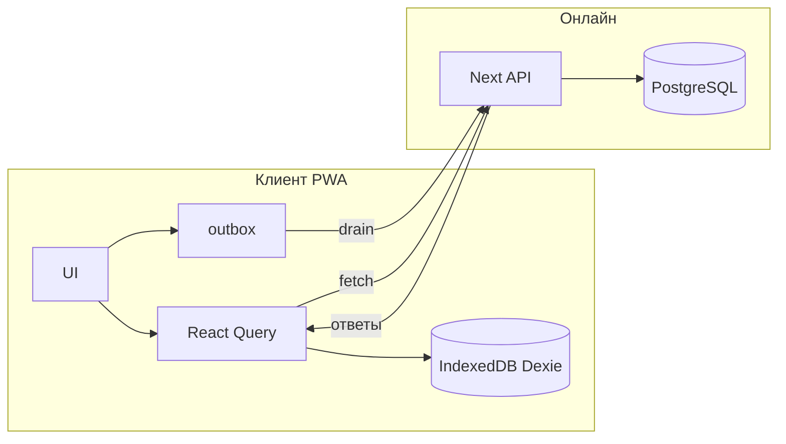

# Офлайн-режим и синхронизация с сервером

Цель: пользователь работает как обычно; при отсутствии сети данные остаются доступными локально, изменения и запросы к нейросети ставятся в очередь; после появления интернета очередь обрабатывается и состояние согласуется с PostgreSQL.

## 1. Слои данных

| Слой | Назначение |
|------|------------|
| **Сервер** | Источник правды после успешного применения операций: Prisma + PostgreSQL. Поля `syncedAt` у `Plant`, `Photo`, `Analysis` — отметка последней успешной синхронизации с клиента (опционально для отладки и мультиустройства). |
| **Клиент (IndexedDB)** | Кэш последнего известного состояния грядок/растений/работ + **исходящая очередь** (outbox) необработанных мутаций и AI-задач + **локальные бинарники** фото до загрузки. |
| **React Query** | В онлайне — как сейчас. В офлайне — чтение из кэша (после подключения persist-слоя) + оптимистичные обновления, согласованные с outbox. |

Библиотека локальной БД: **Dexie** (`lib/offline/local-db.ts`). Ранее в D-004 фигурировал localForage; для таблиц «очередь + блобы + снимок сущностей» удобнее IndexedDB через Dexie.

## 2. Классификация операций

### 2.1 Только локально (без сети)

- Просмотр уже закэшированных грядок, растений, календаря с плановыми работами (если они есть в кэше).
- Добавление в очередь любых мутаций, которые на сервере уже имеют эквивалентные API.

### 2.2 Требуют сеть / AI (очередь до появления сети)

- Анализ фото (`/api/ai/analyze`).
- Чат с агрономом (`/api/chat`).
- Генерация таймлайна (`/api/plants/[id]/timeline/generate`).
- Генерация деталей культуры (`/api/guide/detail`).
- Загрузка фото на сервер (если хранение только на сервере/CDN) — в очереди хранится локальный `blobId` + метаданные.
- Оплата, push, погода в реальном времени — по желанию не класть в outbox, а показывать «недоступно офлайн».

### 2.3 Штатно онлайн (как сейчас)

При `navigator.onLine` и успешной «проверке живости» (см. ниже) мутации идут сразу в API; при успехе обновляются IndexedDB-кэш и React Query.

## 3. Детекция «есть интернет»

`navigator.onLine` **недостаточно** (часто true при отсутствии маршрута). Рекомендуется:

1. События `online` / `offline`.
2. Периодический лёгкий **ping** на свой же origin: `GET /api/health` с таймаутом 3–5 с.
3. Состояние в React: `useNetworkStatus()` (`lib/hooks/use-network-status.ts`).

Синхронизацию outbox запускать только при переходе в состояние «онлайн + health OK».

## 4. Исходящая очередь (outbox)

Запись в IndexedDB (таблица `outbox`):

- `id` — локальный UUID (cuid/uuid).
- `action` — строка, например `CREATE_PLANT`, `AI_ANALYZE_PHOTO` (согласуется с серверной `TaskQueue.action`, если будете дублировать на сервере).
- `payload` — JSON (для фото — ссылка на `localBlobId`, не сам файл).
- `status`: `pending` | `syncing` | `failed` | `done` (done можно удалять при уборке).
- `retries`, `lastError`, `createdAt`.

Порядок: **FIFO** по `createdAt`, чтобы сохранить зависимости (сначала грядка, потом растение). При необходимости — явные `dependsOnOutboxId` в payload.

## 5. Локальные фото

Таблица `localBlobs`: `id`, `blob`, `mimeType`, `createdAt`.  
Outbox для загрузки/анализа ссылается на `localBlobId`. После успешной загрузки на сервер — удалить blob и обновить UI серверным `url`.

## 6. Синхронизация после онлайна

Клиент: `OfflineSyncBridge` вызывает drain при событии «онлайн» + health OK, затем **каждые ~60 с** (если сессия активна) и при **возврате вкладки в foreground** (`visibilitychange` / `focus`), чтобы очередь не зависала после нестабильной сети. Для нативной оболочки см. комментарий в `components/offline-sync-bridge.tsx`.

1. **Drain outbox**: по одной записи (или малыми батчами), вызов соответствующего `fetch` к существующим API.
2. При успехе: пометить `done`, обновить кэш сущностей, инвалидировать React Query keys.
3. При 401/403: остановить очередь, разлогинить или запросить обновление сессии.
4. При 5xx / сетевой ошибке: `failed` или `pending`, увеличить `retries`, экспоненциальная задержка.

Отдельный **batch-endpoint** `POST /api/sync` (опционально, фаза 2): принимает массив операций в одной транзакции — уменьшает round-trip, упрощает серверный `TaskQueue`.

## 7. Конфликты

Минимальная политика для первой версии: **последняя запись с сервера побеждает** при полном рефетче после синка; локальные «висящие» правки, не попавшие в outbox, не должны возникать (все мутации офлайн только через outbox + optimistic UI).

Для мультиустройства позже: `updatedAt` на сервере + отказ принять устаревший PATCH (409) с мержем в UI.

## 8. Кэш «все данные пользователя»

- **Фаза A**: персист React Query (`@tanstack/react-query-persist-client` + IndexedDB persister) для ключей `beds`, `plants`, `timeline`, т.д. — тогда при перезагрузке офлайн остаётся последний снимок.
- **Фаза B**: явные таблицы Dexie `beds`, `plants`, … зеркалом ответов API — проще для произвольных запросов без привязки к queryKey.

Рекомендация: начать с **Фазы A** (меньше дублирования схемы).

## 9. Серверная `TaskQueue`

Таблица уже есть в Prisma. Варианты:

- **Только клиент**: очередь только в IndexedDB; сервер не хранит дубликат.
- **Гибрид**: при онлайн клиент дополнительно шлёт `POST /api/tasks` для резервной копии и обработки cron с сервера — избыточно для MVP.

Для MVP достаточно **клиентского outbox**.

## 10. Порядок внедрения (этапы)

1. **Сеть + outbox + Dexie** (текущий коммит): типы, БД, постановка в очередь вручную из одного места (проверка).
2. **Persist React Query** — офлайн чтение грядок без перезапуска с «пустым» UI.
3. **Обёртка `apiFetch` / хуки мутаций** — все `POST/PATCH/DELETE` из сада и календаря: онлайн → API, офлайн → outbox + optimistic cache.
4. **Фото**: сохранение в `localBlobs`, задачи `UPLOAD_PHOTO` / `AI_ANALYZE_PHOTO`. **Сделано на клиенте:** `UPLOAD_PHOTO`, офлайн `DELETE_PHOTO`, `AI_ANALYZE_PHOTO` (см. `sync-engine`, камера, `useUploadPlantPhoto` / `useDeletePlantPhoto`).
5. **AI**: чат и анализ — через очередь офлайн (**реализовано** для камеры, чата, ИИ в справочнике, генерации таймлайна); индикатор «В очереди: N» и онлайн/офлайн — `SyncStatusBar`.
6. **Batch sync** и политика конфликтов при необходимости.

## 11. Диаграмма потока

---

См. реализацию-заготовку: `lib/offline/*`, `lib/hooks/use-network-status.ts`. Подключение ко всем экранам — по этапам 2–5 выше.
